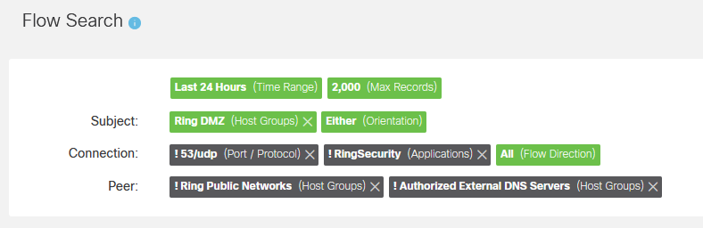

<div id="top"></div>
<!--
*** Thanks for checking out the Best-README-Template. If you have a suggestion
*** that would make this better, please fork the repo and create a pull request
*** or simply open an issue with the tag "enhancement".
*** Don't forget to give the project a star!
*** Thanks again! Now go create something AMAZING! :D
-->


<!-- PROJECT SHIELDS -->
<!--
*** I'm using markdown "reference style" links for readability.
*** Reference links are enclosed in brackets [ ] instead of parentheses ( ).
*** See the bottom of this document for the declaration of the reference variables
*** for contributors-url, forks-url, etc. This is an optional, concise syntax you may use.
*** https://www.markdownguide.org/basic-syntax/#reference-style-links
-->

[![Stargazers][stars-shield]][stars-url]
[![Issues][issues-shield]][issues-url]
[![MIT License][license-shield]][license-url]
[![LinkedIn][linkedin-shield]][linkedin-url]


<!-- PROJECT LOGO -->
<br />
<div align="center">
  <a href="https://github.com/othneildrew/Best-README-Template">
    
  </a>

  <h3 align="center">SNA Direct Host Scan</h3>

  <p align="center">
    Identify Peer IP addresses and Add to the Hostgroup of Your Choice!
    <br />
    <a href="https://github.com/othneildrew/Best-README-Template/issues">Report Bug</a>
    ·
    <a href="https://github.com/othneildrew/Best-README-Template/issues">Request Feature</a>
  </p>
</div>


<!-- TABLE OF CONTENTS -->
<details>
  <summary>Table of Contents</summary>
  <ol>
    <li>
      <a href="#about-the-project">About The Project</a>
      <ul>
        <li><a href="#built-with">Built With</a></li>
      </ul>
    </li>
    <li>
      <a href="#getting-started">Getting Started</a>
      <ul>
        <li><a href="#prerequisites">Prerequisites</a></li>
        <li><a href="#installation">Installation</a></li>
      </ul>
    </li>
    <li><a href="#usage">Usage</a></li>
    <li><a href="#roadmap">Roadmap</a></li>
    <li><a href="#contributing">Contributing</a></li>
    <li><a href="#license">License</a></li>
    <li><a href="#contact">Contact</a></li>
    <li><a href="#acknowledgments">Acknowledgments</a></li>
  </ol>
</details>


<!-- ABOUT THE PROJECT -->
## About The Project

Use this to look up Outside Host IP addresses from  and look for domain data.  That data will allow you to drop those identified IP addresses into your chosen host groups.  
This will perform a Flow Query to identify unknown outside hosts.  It will then connect to the hosts and use certificate information to classify these IP's into hostgroups.

Since for some services - IP's can change frequently. There is also a Hostgroup Cleanup script which can attempt to connect to identified IPs and validate that they are still current.  If not - they will be removed from the hostgroup.


<p align="right">(<a href="#top">back to top</a>)</p>


### Built With

* [Python](https://python.org/)

#### APIs Used
* [Cisco Secure Network Analytics API Reference](https://developer.cisco.com/docs/stealthwatch/enterprise/)

<p align="right">(<a href="#top">back to top</a>)</p>


<!-- GETTING STARTED -->
## Getting Started

This is an example of how you may give instructions on setting up your project locally.
To get a local copy up and running follow these simple example steps.
<!--
### Prerequisites

This is an example of how to list things you need to use the software and how to install them.
* npm
  ```sh
  npm install npm@latest -g
  ```
-->

### Installation

1. Clone the repo
   ```sh
   git clone https://github.com/gobblegoob/SNA-Automatron.git
   ```
2. Install dependencies from requirements.txt
   ```sh
   pip install -r requirements.txt
   ```

<p align="right">(<a href="#top">back to top</a>)</p>


<!-- USAGE EXAMPLES -->
## Usage

Some internet based applications can have highly dynamic public IP addresses.  In order to accurately monitor the activity on these applications - keeping up-to-date and accurate host groups is necessary.

### DirectHostScan.py
This script will perform lookups against identified domains and certificate search strings to identify and categorize IP's you connect to in your organization.  

To prepare the application, you need to configure the following
1. Identify your hostgroups, domains, and search strings if necessary
2. Create a Flow query that is optimized for the outside hosts you want to identify.  Exclude all previously identified outside hosts.  Exclude any internal hosts as well if necessary.
3. Configure the sna.json file wiht your credentials, SMC FQDN/IP and search criteria.
4. Configure the search_data dictionary in DirectHostScan.py to contain your hostgroups, URLs, and necessary search strings if URLs aren't specific enough.  Note, search strings are regex.


### Setup
The application will perform the following tasks:
1. Execute a Flow Query on SNA per the query parameters you apply in the sna.json file
2. Configure your hostgroup and domain searches.  This is done by updating the search_data dictionary in DirectHostScan.py.  You can query as many domains as necessary.
```
    search_data = {
        'My Hostgroup 1': {
            'url': 'somedomain.com',
            'search_string': '(somedomian\.com)|(service\.devices)'
        },
        'My Hostgroup 2': {
            'url': 'otherdomain.com',
            'search_string': ''
        },
        ...etc...
    }
```
3. With the results from the flow query, each external host connection on port 443 will be queried for its certificate data. (CN and SAN fields)
4. Will then take the IP's that correspond to your target domains and insert them into your designated Host Group/Tag

<p>Before you set up the script - you need to design a Flow Query to identify the target peer IP addresses you want to query.  The results of this query will be looked up where domain and certificates CN/SANs will be checked to see if they match your targeted domain.  Design and hone your Flow Query in the SNA Flow Query screen.  Once you have designed your query - you can easily transfer the query parameters to the sna.json file.  </p>

<p> ** Example query: ** </p> 


### To set up:
 - Add the following data to sna.json
 <li>SMC hostname/IP and credentials
 <li>Source/Subject Hostgroups to include and exclude from your query
 <li>Destination/Peer hostgroups to include and exclude from your query
 
### Scheduling:
The best way to run this is to run cronjobs calling the scripts wiht the accompanying arguments.  This allows you to run the script against several domains and populate several different host groups without making any changes to code.  You can schedule a cron job in linux to execute the script. To run the script at 11pm each day and output a log file for tracking, add the folloiwng to your crontab file:
```
00 23 * * * cd /[path/to/file] && python ScanToUpdate.py -d [DOMAIN.COM] -t [HOSTGROUP TO UPDATE] -c [REGEX TO SEARCH IN CERT CN OR SAN FIELD] >> tagupdate.log 
20 23 * * * cd /[path/to/file] && python ScanToUpdate.py -d [DOMAIN2.COM] -t [HOSTGROUP TO UPDATE] -c [REGEX TO SEARCH IN CERT CN OR SAN FIELD] >> tagupdate.log 
40 23 * * * cd /[path/to/file] && python ScanToUpdate.py -d [DOMAIN3.COM] -t [HOSTGROUP TO UPDATE] -c [REGEX TO SEARCH IN CERT CN OR SAN FIELD] -rx >> tagupdate.log 
```

- **[Cron Job: A Comprehensive Guide for Beginners 2023](https://www.hostinger.com/tutorials/cron-job)**
- **[Crontab Generator](https://crontab-generator.org/)**

<p align="right">(<a href="#top">back to top</a>)</p>


<!-- ROADMAP -->
## Roadmap

- [ ] generate log file


See the [open issues](https://github.com/othneildrew/Best-README-Template/issues) for a full list of proposed features (and known issues).

<p align="right">(<a href="#top">back to top</a>)</p>


<!-- CONTRIBUTING -->
## Contributing

If you wish to contribute or have feature or usage suggestions, leave me a message.

<p align="right">(<a href="#top">back to top</a>)</p>


<!-- LICENSE -->
## License

Distributed under the MIT License. See `LICENSE.txt` for more information.

<p align="right">(<a href="#top">back to top</a>)</p>


<!-- CONTACT -->
## Contact

Project Link: [https://github.com/gobblegoob/SNA-Automatron](https://github.com/gobblegoob/SNA-Automatron)

<p align="right">(<a href="#top">back to top</a>)</p>


<!-- ACKNOWLEDGMENTS -->
## Acknowledgments


Thank yous

* [denapom11 SNA Examples](https://github.com/CiscoDevNet/stealthwatch-enterprise-sample-scripts)
* [othneildrew Best README Template](https://github.com/othneildrew/Best-README-Template)


<p align="right">(<a href="#top">back to top</a>)</p>


<!-- MARKDOWN LINKS & IMAGES -->
<!-- https://www.markdownguide.org/basic-syntax/#reference-style-links -->
[contributors-shield]: https://img.shields.io/github/contributors/othneildrew/Best-README-Template.svg?style=for-the-badge
[contributors-url]: https://github.com/othneildrew/Best-README-Template/graphs/contributors
[forks-shield]: https://img.shields.io/github/forks/othneildrew/Best-README-Template.svg?style=for-the-badge
[forks-url]: https://github.com/othneildrew/Best-README-Template/network/members
[stars-shield]: https://img.shields.io/github/stars/othneildrew/Best-README-Template.svg?style=for-the-badge
[stars-url]: https://github.com/gobblegoob/SNA-Automatron/stargazers
[issues-shield]: https://img.shields.io/github/issues/othneildrew/Best-README-Template.svg?style=for-the-badge
[issues-url]: https://github.com/gobblegoob/SNA-Automatron/issues
[license-shield]: https://img.shields.io/github/license/othneildrew/Best-README-Template.svg?style=for-the-badge
[license-url]: https://github.com/gobblegoob/SNA-Automatron/blob/main/LICENSE
[linkedin-shield]: https://img.shields.io/badge/-LinkedIn-black.svg?style=for-the-badge&logo=linkedin&colorB=555
[linkedin-url]: https://linkedin.com/in/
[product-screenshot]: images/screenshot.png
